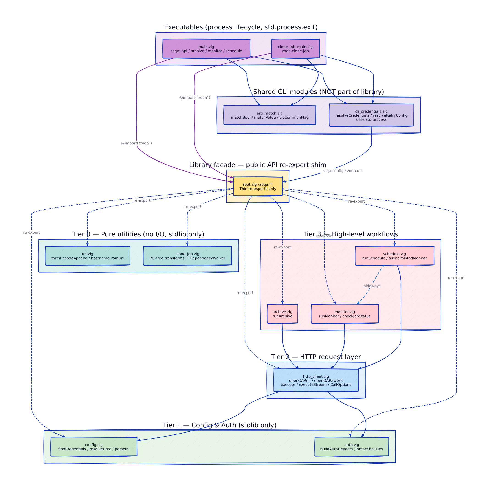
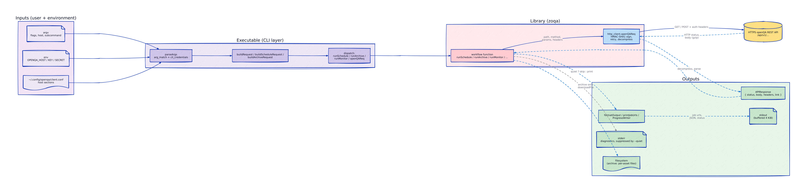
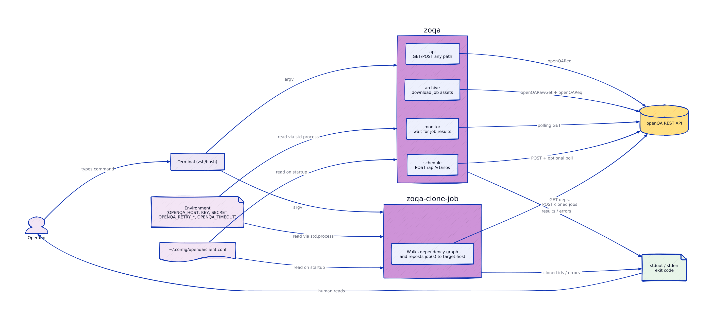
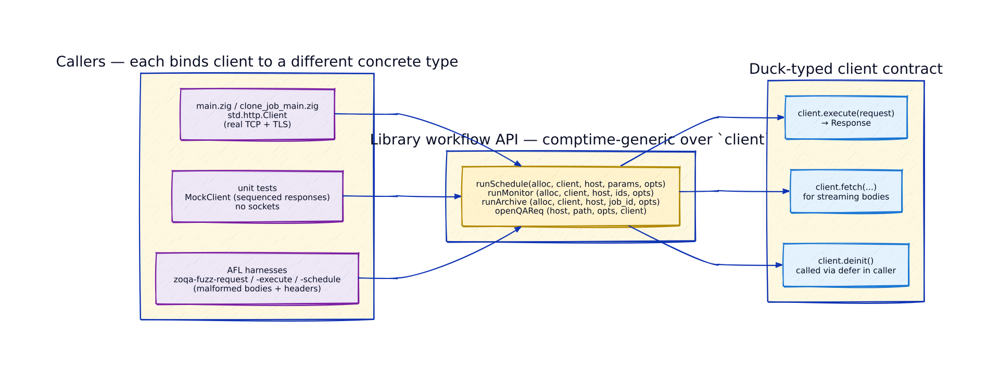
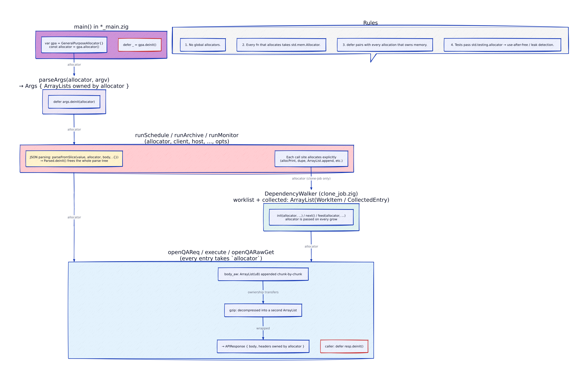
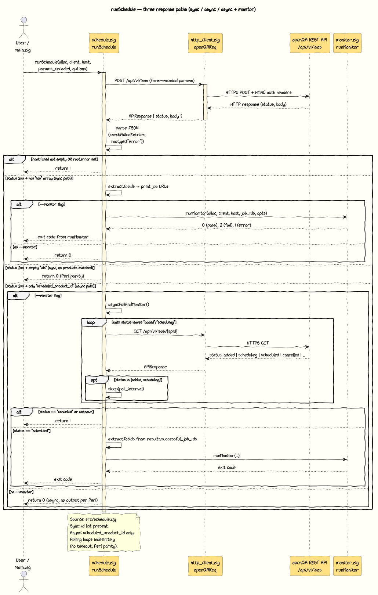
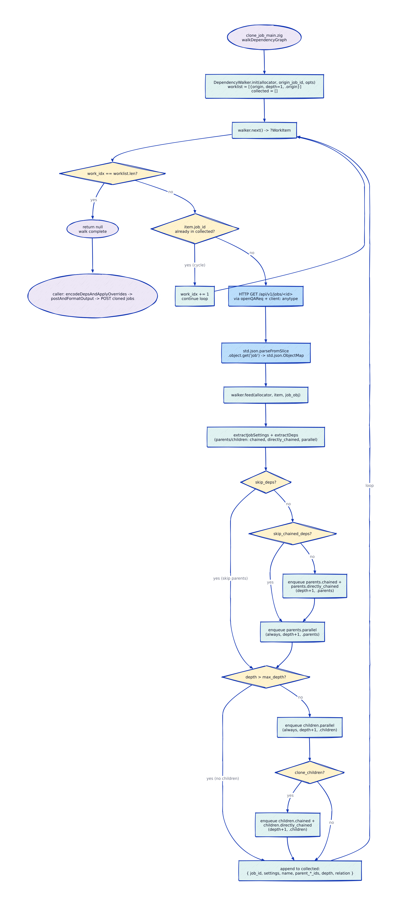

# Architecture

## Overview

zoqa is structured as **one library and multiple executables**. The
library provides the core openQA protocol logic; executables handle
CLI-specific concerns (argument parsing, environment variables, process
lifecycle).

---

## Layers

### Library layer (`src/root.zig`)

The `zoqa` library is the sole public API for interacting with openQA. It is
designed to be consumed by CLI tools, GUI applications, web frontends, or test
harnesses without modification.

**Rules:**

- No `std.process` dependencies (no env vars, no `exit`, no argv).
- No stdout/stderr output except via the `quiet` flag on diagnostics.
- No CLI-specific concepts (help text, exit codes, argument parsing).
- All I/O is injected via `client: anytype` (dependency injection for testability).
- All allocations are explicit (pass `std.mem.Allocator`, no globals).

**Services exposed:**

- `openQAReq(host, path, opts, client)` — authenticated HTTP request to openQA.
- Workflow orchestrators: `runArchive`, `runMonitor`, `runSchedule`.
- Pure utilities: credential lookup (`config.findCredentials`), host resolution
  (`config.resolveHost`), credential merge (`config.mergeCredentials`), auth
  headers (`auth.buildAuthHeaders`), URL encoding (`url.formEncodeAppend`),
  Link header parsing (`parseLinkHeader`).
- I/O-free data transforms: `clone_job.*` (settings extraction, dependency
  encoding, POST body construction, output formatting, BFS dependency graph
  walker via `DependencyWalker`).

### Shared CLI modules

Modules imported by executables but NOT part of the library. They exist because
multiple executables need the same CLI-layer logic, but that logic involves
process-level concerns that do not belong in a reusable library.

| Module | Purpose | May use `std.process` |
|--------|---------|----------------------|
| `arg_match` | Flag matching primitives (`matchBool`, `matchValue`, `tryCommonFlag`) | No |
| `cli_credentials` | Credential resolution (env + config + CLI merge), retry/timeout env-var parsing | Yes |

**`arg_match`** is purely generic — it knows nothing about openQA. Any CLI tool
can use it. `tryCommonFlag` is a comptime-generic dispatch for the five flags
shared between all openQA executables (`--host`, `--apikey`, `--apisecret`,
`--verbose`, `--help`), duck-typed against the caller's args struct.

**`cli_credentials`** orchestrates the credential priority chain
(CLI flags > environment variables > config file) and env-var resolution for
retry/timeout knobs. It imports the `zoqa` library for `config.findCredentials`,
`config.mergeCredentials`, and `url.hostnameFromUrl`.

### Executable layer (`*_main.zig`)

Each executable owns:

- Its `Args` struct and `parseArgs` function.
- Help text and exit-code policy.
- Subcommand dispatch and error formatting.
- The process lifecycle (`main()`, `std.process.exit`).

**Rules:**

- Executables import `zoqa` (library), `arg_match`, and `cli_credentials`.
- Business logic lives in the library; executables are thin orchestration shells.
- Each executable may define its own named helper functions for multi-phase
  workflows (e.g., `walkDependencyGraph` drives the library's `DependencyWalker`
  with HTTP I/O and `process.exit` error handling) that are too I/O-heavy or
  tool-specific for the library.

---

## Design Principles

1. **Library purity.** A GUI or web frontend can call `zoqa.openQAReq(...)` and
   `zoqa.runSchedule(...)` without pulling in any CLI machinery.

2. **Dependency injection.** HTTP I/O is injected via `client: anytype`. This
   enables deterministic unit tests and full-loop fuzz testing without network
   access.

3. **Explicit allocation.** Every function that allocates takes an
   `std.mem.Allocator`. No global allocators, no hidden heap usage.

4. **Credential priority.** CLI flags > Environment variables > Config file.
   Resolved per-field (key and secret independently).

5. **Behavioural parity, not architectural parity.** The Perl reference
   (`openqa-cli`, `openqa-clone-job`) is the oracle for user-visible behaviour.
   Internal structure is free to diverge and improve.

6. **I/O-free where possible.** Data-transform modules (`clone_job.zig`,
   `url.zig`) contain zero I/O and are trivially testable and fuzzable.
   Modules that need I/O accept it via injection, never via global state.

7. **Reusable graph traversal.** The `DependencyWalker` in `clone_job.zig` is a
   pull-based BFS iterator that separates traversal logic (cycle detection,
   depth tracking, dependency filtering) from I/O. Any frontend (CLI, GUI,
   test harness) drives the same walker by calling `next()` → fetch → `feed()`.

---

## Build Modules

```
build.zig:
  lib_mod (zoqa)        -> src/root.zig              [library: UX-agnostic]
  arg_match_mod         -> src/arg_match.zig         [CLI parsing primitives]
  cli_creds_mod         -> src/cli_credentials.zig   [CLI env/credential resolution]
  exe (zoqa)            -> src/main.zig              [imports: zoqa, arg_match, cli_credentials]
  clone_exe             -> src/clone_job_main.zig    [imports: zoqa, arg_match, cli_credentials]
```

---

## Module Dependency Graph

```
arg_match.zig        <- (no deps, only std)
cli_credentials.zig  <- imports zoqa (for config + url)
      |
      | imported by both executables
      v
main.zig ----------> zoqa (root.zig)
clone_job_main.zig -> zoqa (root.zig)
```

The library (`root.zig`) has no knowledge of `arg_match` or `cli_credentials`.
Those modules depend downward on `zoqa` — never the reverse.

---

## Architecture Diagrams

The diagrams below are authored as text (diagram-as-code) under
`docs/diagrams/` and rendered with the
[`mpagot/swgraph`](https://github.com/mpagot/swgraph) container. Source
files are committed alongside their rendered PNGs; SVGs are regenerated on
demand (gitignored). The committed PNGs are the hand-drawn / xkcd-style
variants — they were produced with `--sketch`.

To re-render everything after edits, run the helper script:

```bash
./docs/diagrams/render.sh --sketch     # canonical: hand-drawn style
./docs/diagrams/render.sh              # plain (clean-line) variant
```

The script auto-discovers source files, picks `podman` or `docker`, and pulls
the `mpagot/swgraph` image (override with `SWGRAPH_IMAGE=...`).

### 1. Layered modules

Tiered structure: executables and CLI-shared modules sit above the library
facade; the library itself is acyclic, leaves at the bottom.



Source: [`zoqa_tiered_modules.d2`](diagrams/zoqa_tiered_modules.d2) · d2

### 2. Data flow (CLI → server → stdout)

The request path (solid) and the response path (dotted) — argv/env/config in
on the left, `stdout` / filesystem out on the right.



Source: [`zoqa_data_flow.d2`](diagrams/zoqa_data_flow.d2) · d2

### 3. User interaction with the CLI

What the operator sees: two executables, four subcommands on `zoqa`, plus
`zoqa-clone-job`. Environment and config files feed in at startup.



Source: [`zoqa_user_interaction.d2`](diagrams/zoqa_user_interaction.d2) · d2

### 4. Dependency injection seam (`client: anytype`)

The same workflow function body is driven by three distinct concrete clients
— the real `std.http.Client`, a sequenced `MockClient` in tests, and an AFL
fuzz client. This is the cornerstone of the project's testability.



Source: [`zoqa_di_seam.d2`](diagrams/zoqa_di_seam.d2) · d2

### 5. Allocator lifetime

Allocator ownership flows top-down from `main()` through every function that
allocates. No globals, no hidden arenas; tests use `std.testing.allocator`
for leak detection.



Source: [`zoqa_allocator_lifetime.d2`](diagrams/zoqa_allocator_lifetime.d2) · d2

### 6. `runSchedule` sequence

The three response paths of `runSchedule`: synchronous (`ids` returned),
synchronous-but-empty, and asynchronous (`scheduled_product_id` only, with
optional polling and monitor loop).



Source: [`zoqa_runschedule_sequence.puml`](diagrams/zoqa_runschedule_sequence.puml) · PlantUML

### 7. `DependencyWalker` BFS loop

The pull-based BFS iterator in `src/clone_job.zig`. The walker is I/O-free;
the caller fetches each job between `next()` and `feed()`, so the same
walker is used in production, tests, and fuzz harnesses.



Source: [`zoqa_dependency_walker.d2`](diagrams/zoqa_dependency_walker.d2) · d2
